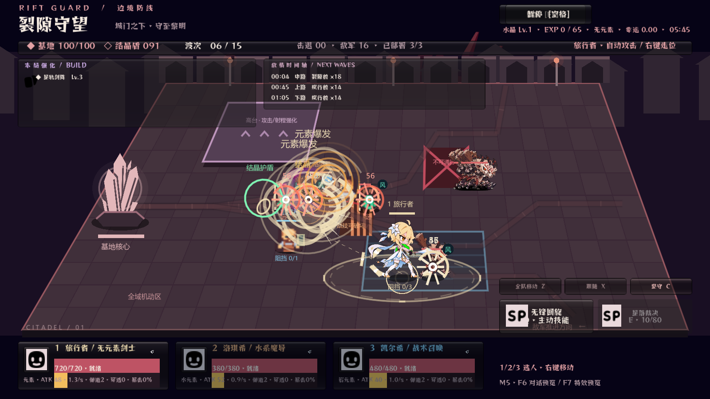
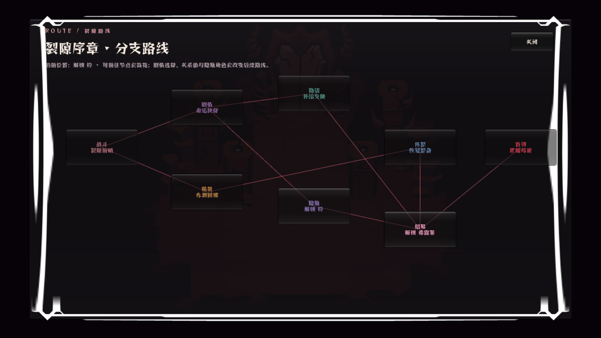
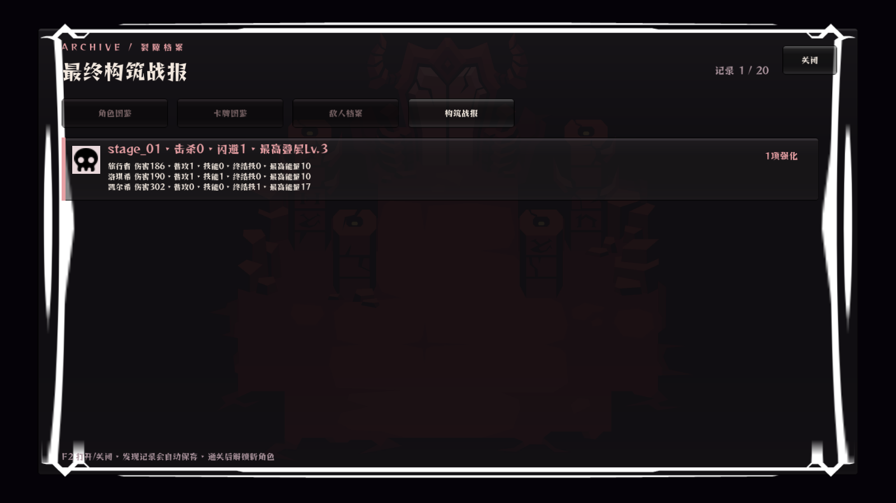

# Rift Guard / 裂隙守望

《裂隙守望》是一款 2.5D 多角色塔防 + Roguelike 构筑 + 分支剧情游戏。玩家从角色卡把最多三名角色拖入战场，在指定路线、动态入口和地形机制中守住基地；每名角色拥有自动攻击、主动技能、终结技和独立能量条。



## V20 核心玩法

- **两种模式**：裂隙守望按关卡推进剧情、解锁角色与路线；无尽生存在大地图边缘持续刷怪，并周期出现六种三阶段 Boss。
- **十二名角色**：旅行者、希露菲、芙宁娜、洛琪希、知更鸟、阿米娅、丰川祥子、艾米莉亚、萨勒芬妮、风堇、凯尔希、铃。
- **拖放部署**：编队角色先进入待部署区，拖到合法战场位置后参战；角色可全地图移动、切换和规避敌方预警。
- **主动战斗**：`Q` 释放当前角色主动技能，`E` 在独立能量充满后释放终结技。动画命中帧同时触发伤害、特效、音效和震屏。
- **元素系统**：风、雷、火、水、岩、冰遵循反应组合；旅行者关内锁定已选元素，神话构筑可同时持有两种元素。
- **274 张强化卡**：五档稀有度，支持无限叠加、弹道/召唤/反应/暴击/护盾/支援标签联动，以及火球分裂、燃烧地面、陨石等等级进化。
- **规则遗物**：八件遗物会改变预警时间、复活、攻速与能量、反应倍率、岩造物生命等局内规则。
- **敌方机制**：飞行、远程、治疗、护盾、分裂、冲锋和增益单位会获得狂暴、爆裂、吸血、闪现、镜像等词缀。
- **地图机制**：路线分岔、单向通行、移动平台、传送带、陷阱和天气均由数据配置驱动。
- **构筑战报**：图鉴保存最近 20 局的强化等级、伤害贡献、技能与终结技次数、最高能量、闪避和最高叠层。



## 操作

- `WASD` 或方向键：移动当前角色。
- 鼠标左键：选择角色、移动、选卡和确认剧情回应。
- 拖动底部角色卡：把待部署角色放入战场。
- `1 / 2 / 3`：切换当前角色。
- `Q`：释放当前角色主动技能；岩元素旅行者进入岩造物放置状态。
- `E`：释放当前角色终结技。
- `Space` 或 `Esc`：打开暂停战术中心。
- `F2`：打开图鉴；`F5`：打开分支路线图。



## 可替换内容

角色、地图、技能和 UI 都通过数据或 manifest 引用，替换素材时无需重写战斗逻辑。

- 角色能力：`game/data/v2/characters.json`
- 强化卡：`game/data/v2/cards.json`、`game/data/v2/mechanic_cards.json`
- 遗物：`game/data/v2/relics.json`
- 分支地图：`game/data/v2/campaign_map.json`
- 关卡与地形：`game/data/v2/stages.json`
- 敌人词缀：`game/data/v2/enemy_affixes.json`
- 剧情与选择：`game/data/story.json`
- 素材映射：`game/data/v2/asset_manifest.json`
- 角色动画：`game/assets/characters/`
- 角色头像与立绘：`game/assets/portraits/`
- 战斗特效：`game/assets/vfx/`
- 地图与水晶：`game/assets/world/`
- 界面与音频：`game/assets/helltaker/`
- 外置 Excel 配置：`content/game_config.xlsx`

## 运行与验收

Windows 构建位于 `builds/rift-guard-v20/RiftGuard-V20.exe`。Godot 4.4 工程入口为 `game/project.godot`。

```powershell
Godot_v4.4.1-stable_win64_console.exe --headless --path game -- --v20-test
```

V20 自动验收包含 46 项检查，验证十二人数据、拖放部署、技能能量、命中帧同步、预警闪避、卡牌进化、遗物、地图机制、敌人词缀和构筑战报。验收截图位于 `docs/v20-validation/`。
