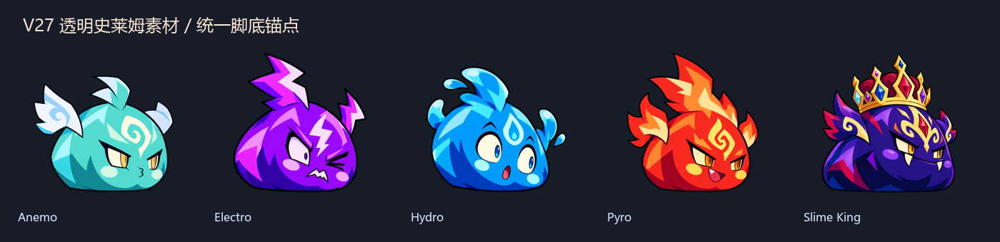

# Rift Guard / 裂隙守望

《裂隙守望》是一款 2.5D 多角色塔防 + Roguelike 构筑 + 分支剧情游戏。玩家从角色卡把最多三名角色拖入战场，在多路线、动态入口和地形机制中守住基地；每名角色拥有独立被动、主动技能、终结技和能量条。


## V29 核心玩法

- **两种模式**：裂隙守望按八个关卡推进剧情、解锁角色与路线；无尽生存在大地图边缘持续刷怪并周期出现 Boss。
- **十二名角色**：旅行者、希露菲、芙宁娜、洛琪希、知更鸟、阿米娅、丰川祥子、艾米莉亚、萨勒芬妮、风堇、凯尔希、铃。每人拥有唯一被动、主动技能、终结技、目标选择方式与战斗时间轴。
- **部署与调度**：角色从待部署区拖入战场，可全地图移动；右键角色卡撤回，之后可重新部署。
- **主动战斗**：`Q` 释放主动技能，`E` 在独立能量充满后释放终结技。伤害、透明特效、音效与震屏在命中帧同步触发。
- **六种三阶段 Boss**：每个 Boss 拥有三套阶段招式、形状不同的攻击预警和阶段转换演出。
- **战术契约**：每张地图提供击杀、反应或生存目标，完成后即时获得幸运、护盾、能量或治疗奖励。
- **素材方向与锚点稳定**：带素材角色和怪物会按移动方向翻转，并以逐帧脚底中心锁定世界坐标。
- **五种透明史莱姆**：风、雷、水、火史莱姆与史莱姆王已接入，使用弹跳、压缩、蓄力和受击拉伸。


- **竖向星轨剑阵**：2 / 3 / 6 柄对应 180° / 120° / 60° 间隔，9 级周期触发剑雨。
- **31 个 Boss 阶段招式槽位（29 个独立动作）**：十八个阶段会轮换召唤、炮击、控制、回复和地形破坏，预警形状与实际判定一致。
- **八套地图模板**：折线路、双线、汇流、十字、螺旋、三线、分叉与攻城地图均由路线和地形数据生成。
- **元素系统**：风、雷、火、水、岩、冰支持元素反应；旅行者关内锁定已选元素，神话构筑可同时持有两种元素。
- **274 张强化卡**：五档稀有度，支持无限叠加、标签联动以及火球分裂、燃烧地面、陨石等卡牌进化。
- **规则遗物**：八件遗物改变预警、复活、攻速、能量、反应倍率和岩造物生命等局内规则。
- **敌方词缀**：狂暴、爆裂、吸血、闪现、镜像、护阵、增殖和技能封锁会在后期混合出现。
- **构筑战报**：图鉴保存最近 20 局的强化等级、伤害贡献、技能次数、终结技次数、最高能量、闪避和最高叠层。


## 操作

- `WASD` 或方向键：移动当前角色。
- 鼠标左键：选择角色、移动、选卡和确认剧情回应。
- 拖动底部角色卡：部署待命角色。
- 右键底部角色卡：撤回已部署角色。
- `1 / 2 / 3`：切换当前角色。
- `Q`：释放主动技能；岩元素旅行者进入岩造物放置状态。
- `E`：释放终结技。
- `Space` 或 `Esc`：打开暂停战术中心。
- `F2`：打开图鉴；`F5`：打开分支路线图。


## 可替换内容

角色、地图、技能、动画、特效和 UI 都通过数据或 manifest 引用，替换素材时无需重写战斗逻辑。

- 角色能力与时间轴：`game/data/v2/characters.json`
- 动画状态配置：`game/data/v2/animation_profiles.json`
- 透明特效配置：`game/data/v2/vfx_profiles.json`
- Boss 三阶段招式：`game/data/v2/boss_patterns.json`
- 地图模板：`game/data/v2/stage_templates.json`
- 关卡与地形：`game/data/v2/stages.json`
- 强化卡：`game/data/v2/cards.json`、`game/data/v2/mechanic_cards.json`
- 遗物：`game/data/v2/relics.json`
- 敌人词缀：`game/data/v2/enemy_affixes.json`
- 敌人素材映射：`game/data/v2/enemy_visuals.json`
- 序列帧锚点：`game/data/v2/sprite_pivots.json`
- 剧情与选择：`game/data/story.json`
- 素材映射：`game/data/v2/asset_manifest.json`
- 外置 Excel 配置：`content/game_config.xlsx`
- 动画与透明特效交付规范：`docs/v25-asset-pipeline.md`
- 角色素材就绪度：`docs/asset-readiness-v26.md`
- V27 怪物与锚点素材流：`docs/v27-asset-pipeline.md`
- V29 战斗视觉与命中反馈：`docs/v29-release-notes.md`
- V28 朝向锚点修复：`docs/v28-release-notes.md`
- V27 发布说明：`docs/v27-release-notes.md`
- V26 发布说明：`docs/v26-release-notes.md`

## 技术基础

V29 增加十二角色统一动画状态、按攻速缩放的动作时钟、单次命中标记、严格同步的伤害/特效/音效时间轴，以及十五套元素与反应特效主题。V28 的双向脚底锚点与阴影对齐继续保留，九张地图、十二名角色、六个三阶段 Boss 及其战术契约均由 JSON 配置驱动。

## 运行与验收

Windows 构建位于 `builds/rift-guard-v29/RiftGuard-V29.exe`。Godot 4.4 工程入口为 `game/project.godot`。

```powershell
Godot_v4.4.1-stable_win64_console.exe --headless --path game -- --v29-test
```

V29 自动验收包含 22 项专项检查，并继续执行 V28、V27、V26、V25、V20 和 V17 回归。V29 专项覆盖十二角色动画契约、攻速驱动、命中标记、帧级同步、十五套特效主题、表现事件与部署落点反馈。当前 README 图片展示基础界面，图形截图需要在有桌面图形上下文的会话中重新生成。
