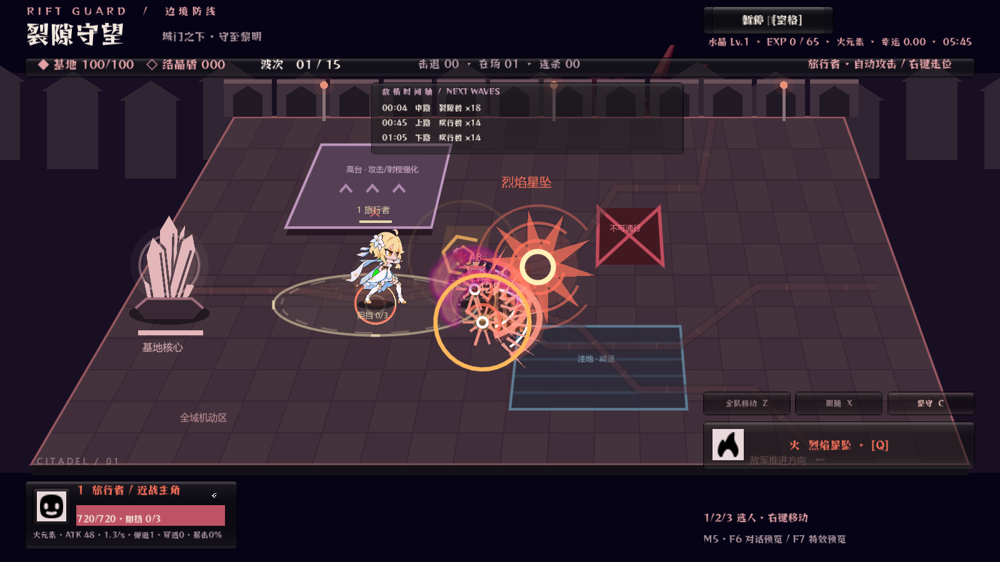
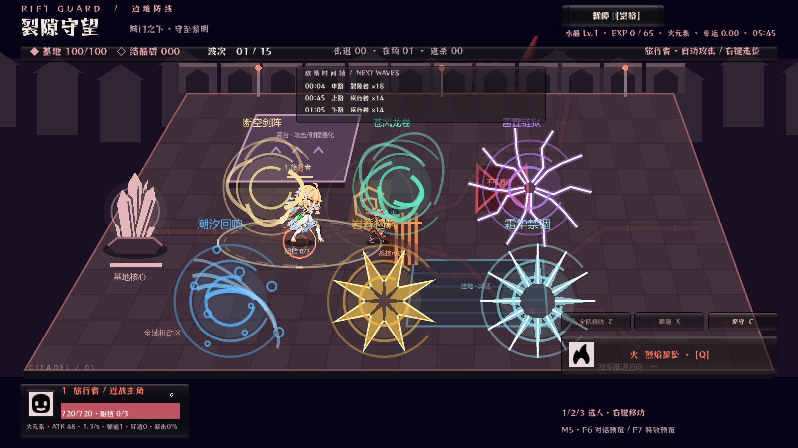
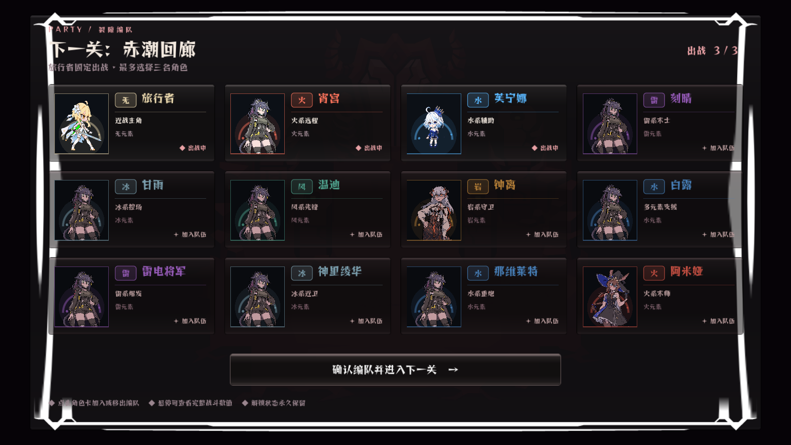

# Rift Guard / 裂隙守望

《裂隙守望》是一款 2.5D 多角色塔防 + Roguelike 构筑 + 分支剧情游戏。玩家操纵旅行者与最多两名同伴在战场上自由移动，守住基地、处理空中与地面敌人，并在升级时从三张强化卡中选择一张，逐步构筑高弹道、高攻速、多元素反应的队伍。



## 核心玩法

- **裂隙守望模式**：怪物沿关卡指定路线推进，通关后进入剧情，通过回应影响奖励、隐藏角色与无尽继承，再在地图右侧迎接新角色并进入下一关。
- **无尽生存模式**：地图扩大到约四个屏幕，敌人从四周边缘追击旅行者；没有基地水晶相关卡牌，队友自动跟随，卡牌可以无限叠加。
- **三人战场与十二人角色库**：旅行者固定出战，当前版本有 12 名角色，编队上限为 3 人。
- **七种元素状态**：无、风、雷、火、水、岩、冰拥有不同弹道、近战斩击和主动技能；旅行者在单关内锁定元素，神话卡可以解锁双元素。
- **元素反应**：蒸发、融化、超载、超导、感电、冻结、扩散、结晶、碎冰与元素爆发会改变伤害、范围、控制或护盾。
- **204 张强化卡**：普通、稀有、史诗、传奇、神话五档卡牌包含数值成长、额外弹道、攻击方式、角色召唤、场外支援、幸运和双元素等构筑方向。
- **敌人与 Boss**：近战、疾跑、重甲、飞行、远程、增益、护盾、冲锋、治疗、分裂、结界等敌人逐步加入；无尽模式有 6 个三阶段 Boss。



## 操作

- `WASD` 或方向键：移动当前角色。
- 鼠标左键：选择角色、移动、选卡和确认剧情回应。
- `1 / 2 / 3`：切换场上角色。
- `Space`：释放旅行者当前元素主动技能；岩元素进入岩造物放置状态。
- `Esc`：打开暂停战术中心，可查看强化等级、角色数值、编队、关卡、设置、重开或返回主菜单。

## 编队与角色预览

编队界面使用 4×3 的独立角色卡，每张卡只显示动态呼吸预览、元素、姓名、定位和选择状态，完整数值放在悬停提示中。旅行者使用 48 帧呼吸图集，芙宁娜使用现有 8 帧图集，其他角色在正式序列帧到位前使用立绘呼吸占位。



## 素材与替换

所有可替换素材入口集中在 [`game/data/v2/asset_manifest.json`](game/data/v2/asset_manifest.json)。角色卡会自动读取 `portrait` 或带有 `idle_frames`、`idle_columns`、`idle_cell` 元数据的呼吸图集；后续替换同一角色素材时无需修改 UI 代码。

- 角色动画：`game/assets/characters/`
- 角色头像与立绘：`game/assets/portraits/`
- 战斗特效：`game/assets/vfx/`
- 地图与水晶：`game/assets/world/`
- Helltaker 风格界面与音频：`game/assets/helltaker/`
- 数据表：`game/data/v2/`
- 外置 Excel 配置：`content/game_config.xlsx`
- 完整交付要求：[`docs/art-asset-request-v19.md`](docs/art-asset-request-v19.md)
- 后续美术路线：[`docs/art-roadmap-v19.md`](docs/art-roadmap-v19.md)

第三方素材的来源与许可证记录在各素材目录的 LICENSE 文件和 manifest 中。发布前可按相同入口替换成最终授权素材。

## 运行与开发

Windows 可直接运行 `builds/rift-guard-v19/RiftGuard-V19.exe`。Godot 4.4 工程入口是 [`game/project.godot`](game/project.godot)，进入工程后运行主场景即可。

V19 自动验收命令：

```powershell
Godot_v4.4.1-stable_win64_console.exe --path game -- --v19-test
```

验收报告与截图位于 [`docs/v19-validation`](docs/v19-validation)。
